#APP GESTION DE CIUDADELA - URBANIZACIÓN PARRAGA

Proyecto desarrollado en flutter para la asignatura de desarrollo de aplicaciones móviles.

##FUNCIONALIDADES 
* **Consulta de Alicuotas:** Visualización de estados de pago mensuales.
* **Espacios Comunes:** Listado de áreas disponibles para los residentes.
* **Navegación:** Implementación de rutas entre pantallas.

##ESTRUCTURA DEL PROYECTO
* 'lib/main.dart': Punto de entrada
* 'lib/screen/': Pantallas principales de la aplicación.

##CAPTURAS DE PANTALLAS

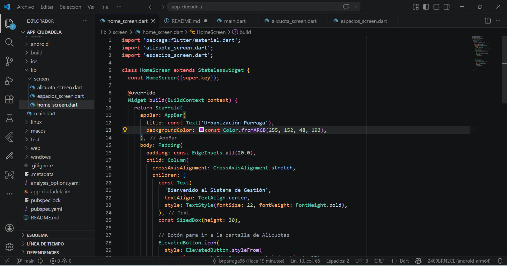 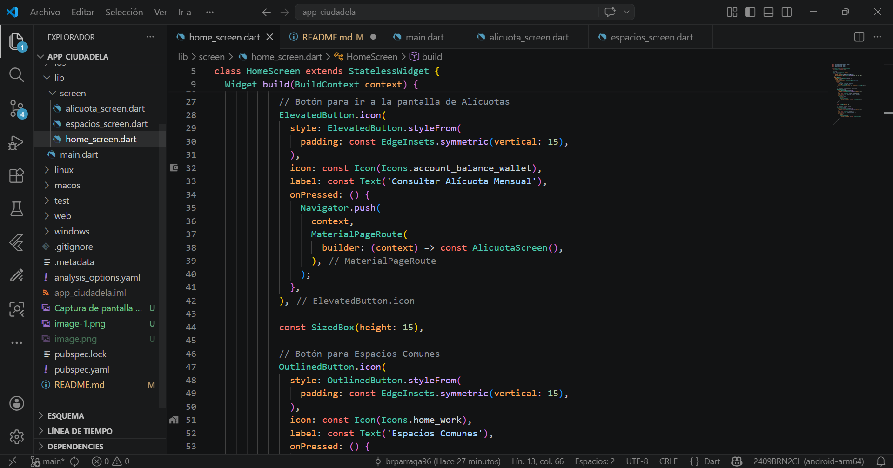
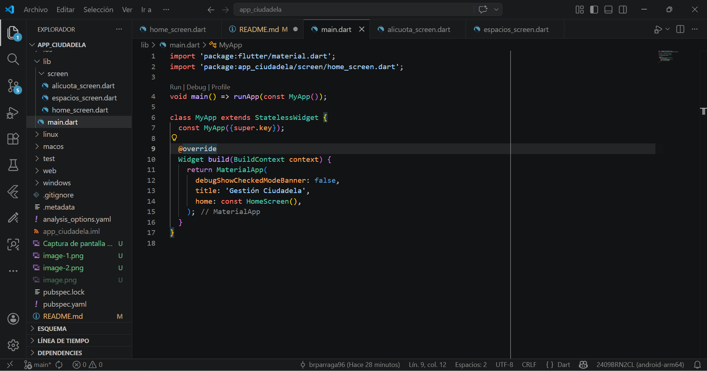
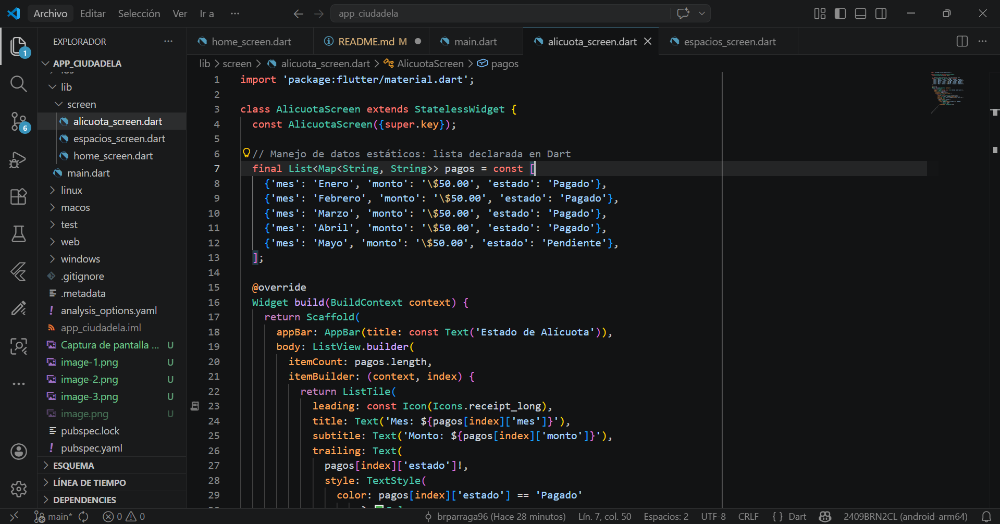 
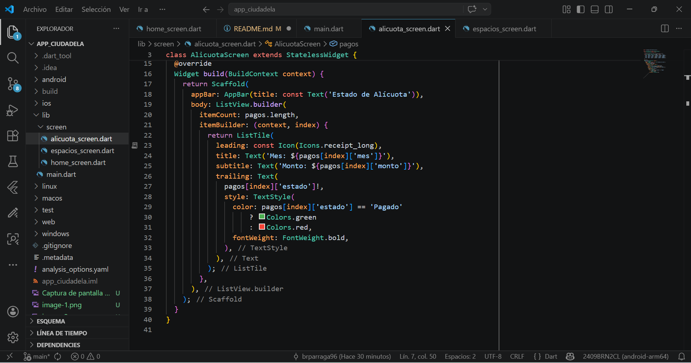
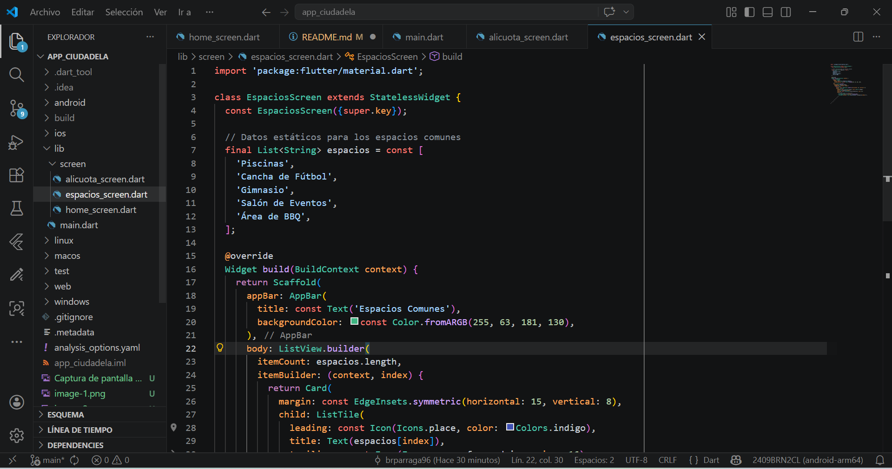 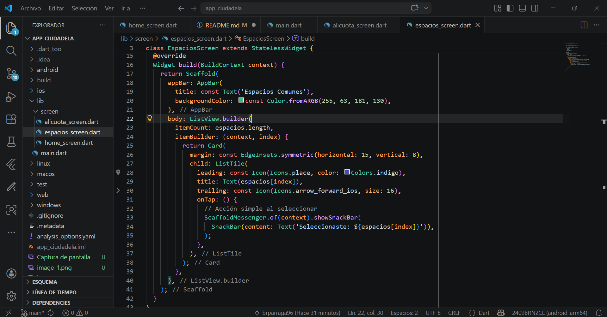
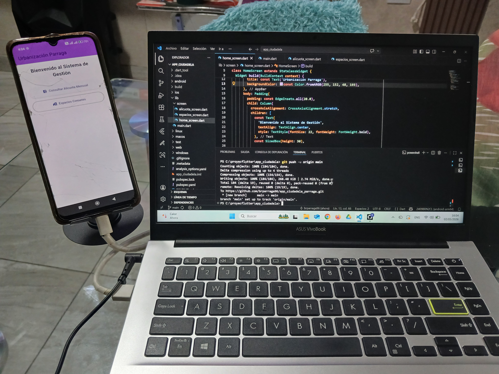 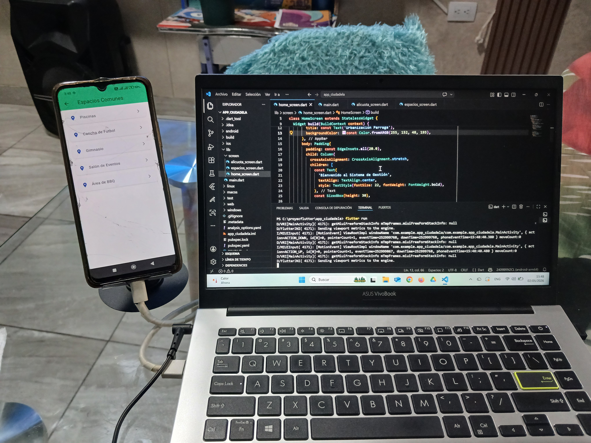 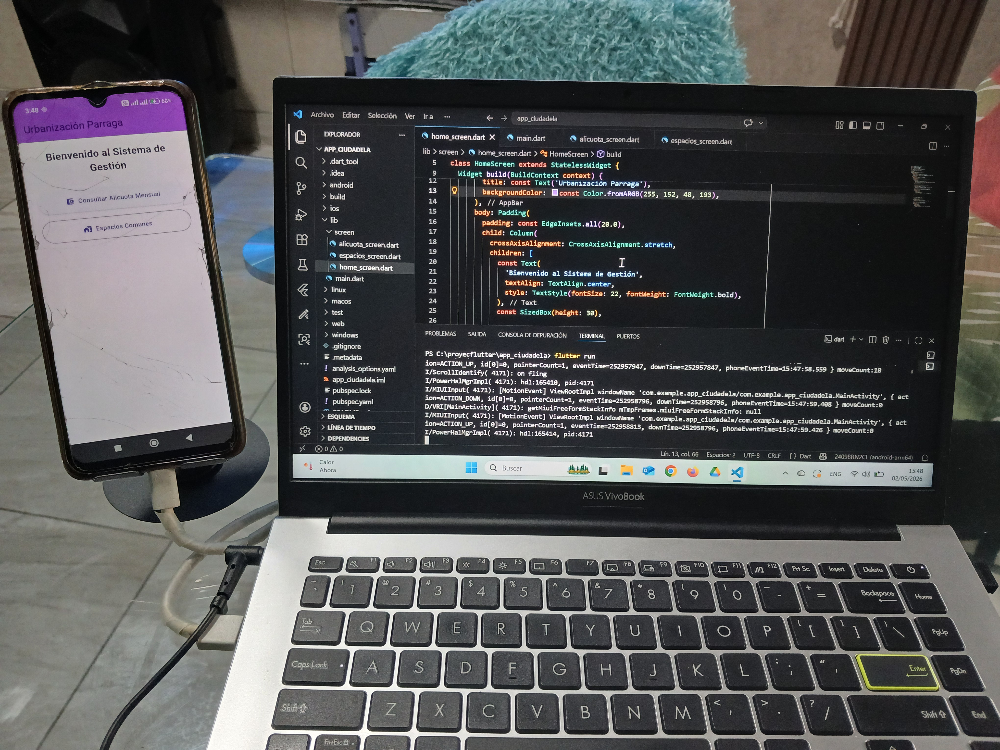 !
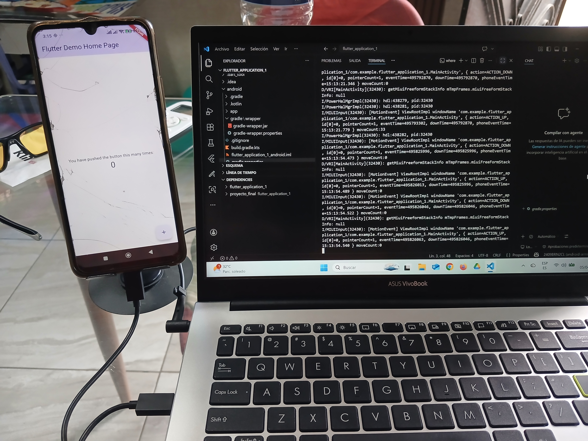
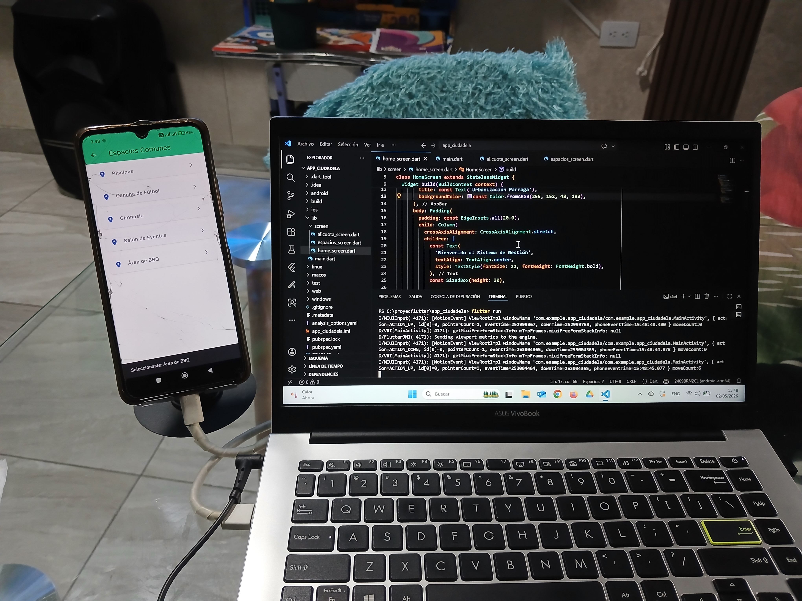